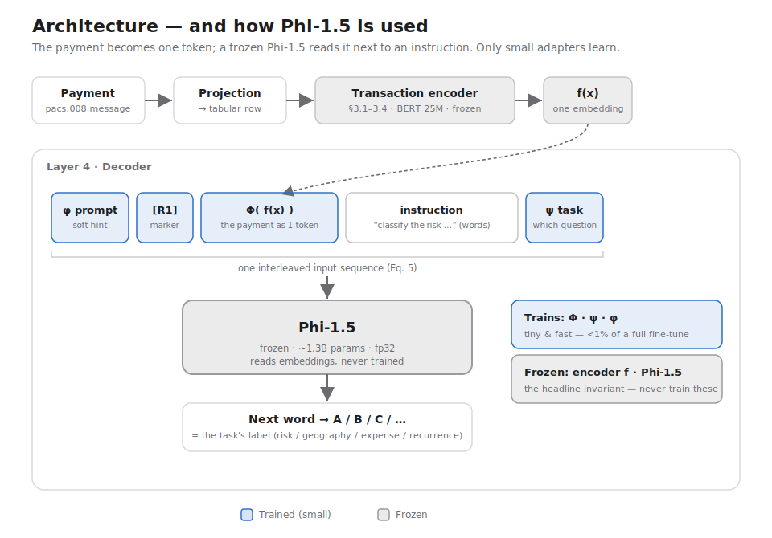

# Transaction Representation Learning — Fraud/Risk POC

A grounded, faithful prototype of:

> Raman, Ganesh, Veloso (JPMorgan AI Research), *Scalable Representation
> Learning for Multimodal Tabular Transactions*, arXiv:2410.07851, NeurIPS 2024.

Applied to ISO 20022 (pacs.008) payments for fraud/risk tagging, on **synthetic
data only**. v1 replicates the paper — no extensions.

## Architecture — and how Phi-1.5 is used



A payment is projected to a tabular row and encoded by a **frozen 25M tabular
encoder** (§3.1–3.4) into a single embedding `f(x)`. In **Layer 4**, that
embedding becomes one *token*: the adapter `Φ` projects `f(x)` into Phi's
word-embedding space, and it is interleaved (Eq. 5) with a row marker `[R1]`, the
tokenized instruction, and a task vector `ψ`. The whole sequence is fed to a
**frozen Phi-1.5** as `inputs_embeds` — Phi never sees a string and is never
trained. Phi predicts the next word; restricting that distribution to the answer
tokens (`A/B/C…`) gives the task's label.

- **Frozen:** the tabular encoder `f` and Phi-1.5 (~1.3B params, fp32). This is
  the headline invariant — if either trains, it is a different experiment.
- **Trained:** only the small trio `Φ` (adapter), `ψ` (task embedding), and `φ`
  (soft prompt / per-layer prefix) — well under 1% of a full fine-tune.
- **Multi-record tasks** (recurrence) repeat the `[R1] Φ(f(x₁)) … [RM] Φ(f(xₘ))`
  block before the instruction; single-record tasks use one record.
- `LLMInterface` makes the LLM swappable: `MockLLM` for the CPU test suite,
  `HFCausalLM("microsoft/phi-1_5")` for the real GPU run (the paper reports a
  Phi-class and a Falcon model).

## Read these first (in order)
1. `architecture.md` — what each component is (source of truth).
2. `CLAUDE_CODE_HANDOFF.md` — how to build it, phase by phase, with guardrails.
3. `configs/default.yaml` — pinned hyperparameters + thresholds.

## What's built
The full pipeline is implemented and runs end-to-end via `run_gpu.py`:
- `data/synth_pacs008.py` — Algorithm 1 generator + Layer 1 pacs.008 projection.
- `encoders/` — §3.1 partitioning embedder, §3.3 currency-conditioned quantizer,
  §3.2 offline party encoder, and the column assembler (Eq. 4).
- `encoder/tabular_encoder.py` — §3.4 BERT (25M) with the composite
  reconstruction + batch-hard-triplet loss; frozen after pretraining.
- `decoder/multimodal_decoder.py` — §4/§4.1 frozen-`f` + frozen-LLM decoder with
  trainable `{Φ, ψ, φ}` and the multi-record interleaving (Eq. 5).
- `eval/` — CatBoost baseline + imbalance-aware / per-task metrics.
- All four §5 tasks (risk, geography, expense, recurrence) trained jointly; see
  `RESULTS.md` for the C1/C2 outcomes.

## Setup & run
```bash
python3 -m venv .venv && source .venv/bin/activate
pip install -r requirements.txt

# 1. generate data + schema (POC scale)
python data/synth_pacs008.py --parents 4000 --transactions 200000 \
  --out data/pacs008_synth.parquet --schema-out data/column_schema.json

# 2. end-to-end: C1 (encoder) + C2 (decoder, all four tasks) -> results.json
python run_gpu.py                  # full run (GPU, frozen Phi-1.5)
python run_gpu.py --smoke --limit 2000   # fast CPU check on a MockLLM

# scale toward the paper's ~125K account vocab when ready
# python data/synth_pacs008.py --parents 20000 --transactions 1000000 ...
```
Run the test suite with `pytest`.

## The one rule
Fidelity to the paper is the deliverable. Don't extend, don't retune pinned
hyperparameters, keep `f` and the LLM frozen in Layer 4. Only three departures
are sanctioned (pacs.008 schema, currency-conditioned quantization,
imbalance-aware metrics). A fourth must be raised, not slipped in.
